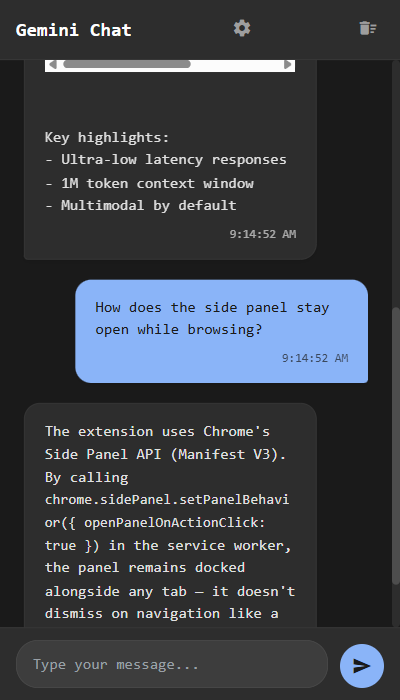
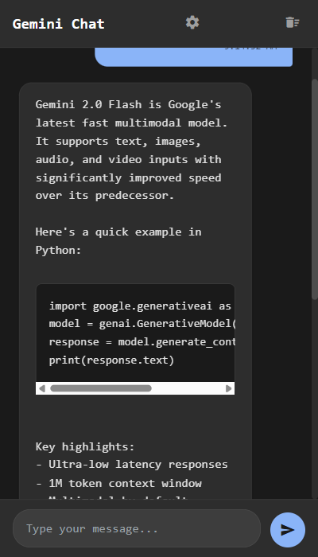
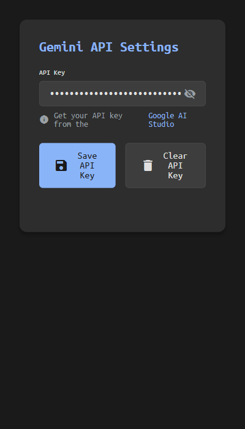
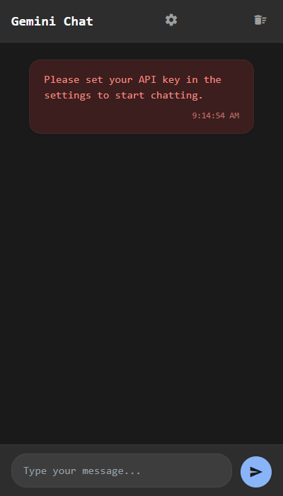
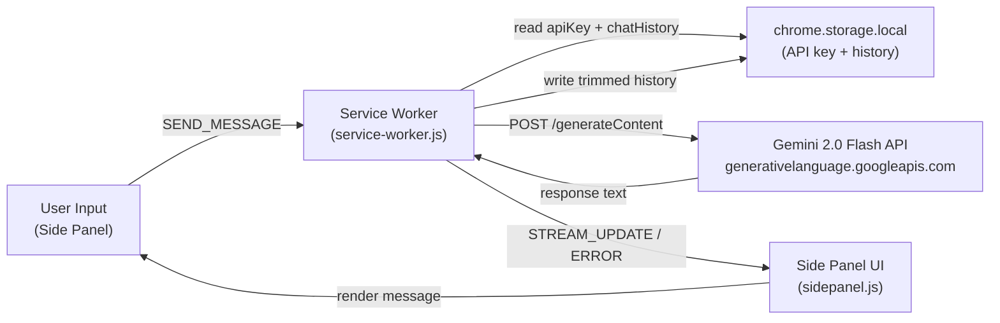

# Gemini Chat Extension

A Chrome side panel extension that brings Gemini 2.0 Flash directly into the browser — persistent alongside any page, with conversation memory across sessions.

  

---

## Screenshots

| Chat in action | Code block rendering | Settings | First-run state |
|---|---|---|---|
|  |  |  |  |

---

## Overview

Gemini Chat Extension opens as a Chrome side panel, so you can chat with Gemini 2.0 Flash while keeping your current tab open. It stores conversation history in `chrome.storage.local` and replays it across sessions, so context survives tab reloads and browser restarts. The entire extension is vanilla JavaScript with no build step, no npm packages, and no bundler.

Designed for developers and power users who want an AI assistant docked to the browser without switching to a separate tab.

---

## Highlights

- **Side panel — not a popup.** Uses Chrome's Side Panel API (Manifest V3) so the chat stays visible beside any webpage without covering content or losing state when you navigate.
- **Session-persistent context.** Conversation history is stored locally and sent with every request. Older messages beyond a 50-message window are trimmed automatically to keep payloads bounded.
- **Live API key validation.** The settings page checks the `AIza` key format locally, then fires a test request to the Gemini models endpoint before saving — no silent failures from a mistyped key.
- **Markdown-like response rendering.** Model replies are rendered with fenced code blocks, inline code, and URL autolinking — formatted output without importing a markdown library.
- **Zero runtime dependencies.** Pure browser APIs and `fetch` — no bundler, no npm, no lock file. Loading the extension is three clicks in `chrome://extensions`.

---

## Features

### Chat Interface
- Docked side panel that persists alongside open tabs
- Auto-resizing textarea (Shift+Enter for newlines, Enter to send)
- Animated three-dot typing indicator while waiting for a response
- Timestamps on every message
- One-click conversation clear (with confirmation prompt)

### Response Formatting
- Fenced code blocks with language class applied to `<code>` elements
- Inline code spans
- Clickable hyperlinks from plain-text URLs in model output

### Settings
- API key stored in `chrome.storage.local`
- Password field with show/hide toggle
- Format pre-check (`AIza` prefix) before saving
- Live validation call to the Gemini models endpoint to confirm the key works

### State Management
- Chat history persisted across sessions via `chrome.storage.local`
- History capped at the last 50 messages before each request
- Service worker orchestrates all API calls; side panel only handles UI

---

## Tech Stack

| Layer | Technology | Purpose |
|---|---|---|
| Extension platform | Chrome Extension Manifest V3 | Side panel, background service worker, storage, options page |
| AI model | Gemini 2.0 Flash (`gemini-2.0-flash`) | Conversational response generation |
| API transport | `fetch` to `generativelanguage.googleapis.com` | REST calls to Gemini generateContent endpoint |
| Persistence | `chrome.storage.local` | API key and conversation history storage |
| UI | Vanilla HTML/CSS/JavaScript | Side panel and settings page, no frameworks |
| Icons | Google Material Icons (CDN) | Toolbar and button icons |
| Typography | Ubuntu Mono (Google Fonts CDN) | Monospace UI font |

---

## Architecture

---

## How It Works

1. **Setup.** The user opens the settings page (options page) and enters a Gemini API key. The extension validates format and fires a test request to the Gemini models endpoint before storing the key in `chrome.storage.local`.

2. **Opening the panel.** The toolbar button opens the side panel (behavior configured at install via `setPanelBehavior({ openPanelOnActionClick: true })`). Existing chat history is loaded from local storage and rendered.

3. **Sending a message.** The side panel sends a `SEND_MESSAGE` event to the service worker. The service worker reads the API key and the full conversation history from storage, appends the new user message, and issues a POST to the Gemini `generateContent` endpoint with the entire history as the `contents` array.

4. **Context trimming.** Before writing back to storage, the service worker trims the combined history (prior messages + new exchange) to the last 50 entries, preventing unbounded context growth.

5. **Response delivery.** The service worker sends a `STREAM_UPDATE` message back to the side panel with the full response text. The side panel hides the typing indicator, renders the message (formatting code blocks and URLs), and re-enables the input.

6. **Error handling.** If the API key is missing, the request fails, or the response shape is unexpected, the service worker sends an `ERROR` message and the side panel displays it inline as a styled error bubble.

---

## Setup

No build step required. The extension runs directly from the source folder.

**Prerequisites**
- Google Chrome (or any Chromium-based browser supporting Manifest V3 and the Side Panel API)
- A Gemini API key from [Google AI Studio](https://makersuite.google.com/app/apikey)

**Load the extension**

1. Open `chrome://extensions` in Chrome.
2. Enable **Developer mode** (toggle in the top-right corner).
3. Click **Load unpacked** and select the `GeminiChatExtension` folder.
4. The extension icon will appear in the Chrome toolbar.

**Configure the API key**

1. Right-click the extension icon and choose **Options**, or click the gear icon inside the side panel.
2. Enter your Gemini API key and click **Save API Key**.
3. The settings page validates the key against the Gemini API before saving.

**Start chatting**

Click the extension toolbar icon. The side panel opens beside the current tab and is ready to use.

---

## Usage

**Basic conversation**

Type any message in the input field and press Enter (or click the send button). The extension sends your message along with the full conversation history for context-aware replies.

**Keyboard shortcuts**

| Action | Key |
|---|---|
| Send message | Enter |
| Insert newline | Shift + Enter |

**Code in responses**

Model responses containing fenced code blocks are rendered as formatted `<pre><code>` elements. Inline code with backticks is also rendered. URLs are converted to clickable links.

**Clearing history**

Click the delete_sweep icon in the chat header and confirm the prompt. This clears the in-memory messages and removes the stored history from `chrome.storage.local`.

**Updating or removing the API key**

Open the options page (gear icon), enter a new key and click **Save API Key**, or click **Clear API Key** to remove it.

---

## Key Decisions

| Decision | Rationale | Tradeoff |
|---|---|---|
| Side Panel API over popup | Chat persists alongside browsing without covering page content; state survives navigation | Requires Chrome with Side Panel support; narrower browser compatibility than a popup |
| Service worker handles all API calls | Keeps the UI layer thin; service workers can run independently of the panel being focused | Service workers can be terminated by the browser; long gaps between messages may require a restart |
| API key stored in `chrome.storage.local` | Simple, zero-config persistence; works offline for reads | Storage is not encrypted at rest; suitable for personal use, not shared profiles |
| Direct `fetch` to Gemini REST API | No dependencies, no bundler required; easy to audit the exact request shape | Manual request construction; no automatic retry, streaming, or SDK convenience methods |
| 50-message history cap | Bounds context payload size and avoids hitting token limits | Oldest messages are silently dropped; no UI indication that history has been trimmed |
| No markdown library | Keeps the extension dependency-free; the regex transforms cover the most common cases | Does not handle all Markdown constructs (tables, blockquotes, nested lists) |

---

## Innovation / Notable Work

**Side Panel as a first-class UI primitive.** Most browser AI extensions use popups that dismiss on click or open a new tab. Wiring the chat to Chrome's Side Panel API means it stays open and in context while the user reads, researches, or codes — a meaningful UX distinction that required working with the `chrome.sidePanel` API introduced in Manifest V3.

**Full conversation context without a backend.** The extension manages multi-turn conversation state entirely on the client: history is read from storage, appended, and written back on every turn. The Gemini API receives the full message array, giving it proper conversational context without any server-side session management.

**API key validation before save.** Rather than accepting whatever the user types and surfacing errors at chat time, the settings page makes a lightweight call to `GET /v1beta/models` on save. This catches invalid keys immediately, reducing a confusing failure mode at chat time to a clear error in the settings UI.

**Lightweight response formatting.** Three targeted regex passes (fenced code blocks, inline code, URL detection) render the most practically useful parts of model output as HTML without pulling in a markdown parser. For a zero-dependency extension, this covers the common cases where plain text would otherwise obscure useful code examples.

---

## About

Built to explore the Chrome Extension Side Panel API and Manifest V3 patterns, and to have a minimal, inspectable Gemini client with no framework overhead. The goal was a working AI chat tool that any developer could load, read, and modify in under an hour.
